# Project Title: Operationalizing Machine Learning

## Project Overview: 
- In this project, we use the Bank Marketing dataset. 
- The goal of this project is to use Azure to configure a cloud-based ML production model, deploy it, and consume it. 
- We create, publish, and consume a pipeline that uses the AutoML step.
- Finally, I demonstrate my work by creating a README file and a screencast video.

## Architectural Diagram

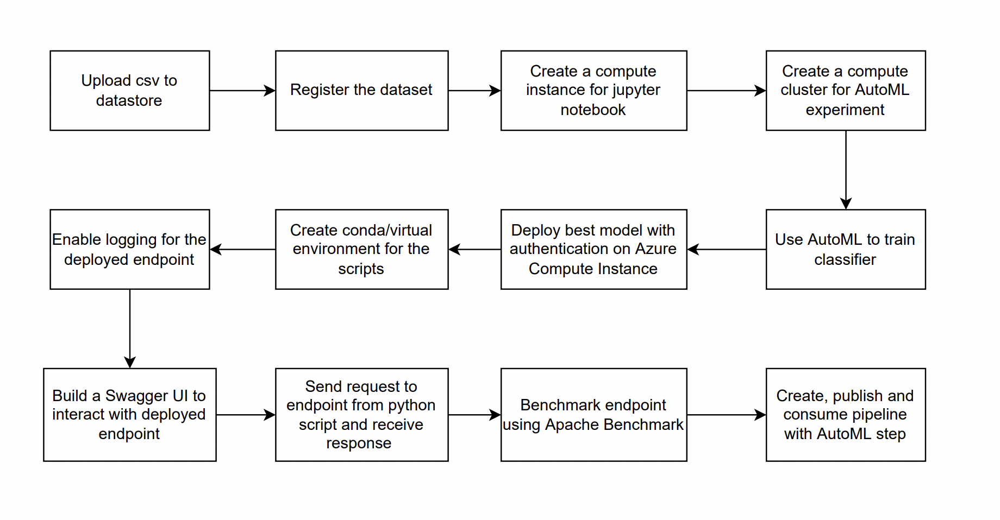

## Key Steps
<b>Step 1: Authentication</b>
- I skipped this step since I used Udacity Lab and thus could not create a Service Principal
 

<b>Step 2: Auto ML Experiment</b>
- Upload data (csv file) to default datastore in Azure ML studio, and register a dataset
- Create a compute instance to be used by the jupyter notebook later 
- Create a compute cluster to be used by the AutoML experiment with min nodes as 1, and max nodes as 5
- Create an AutoML experiment with the above dataset and compute cluster

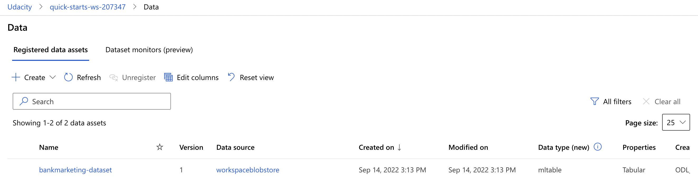

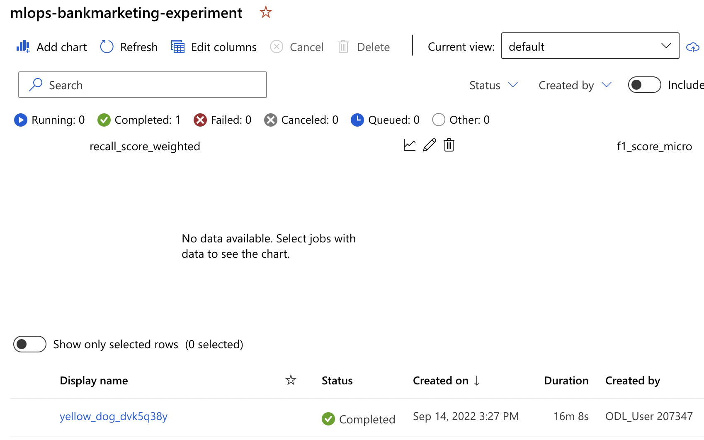

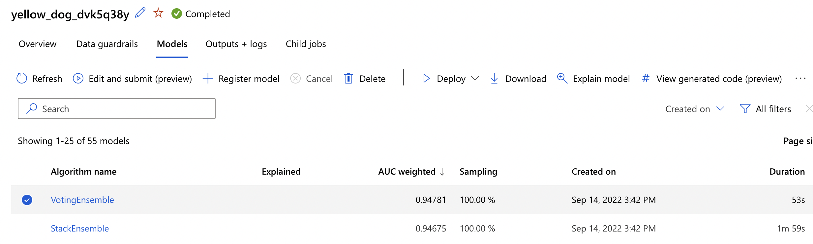

 

<b>Step 3: Deploy Best Model</b>
- Once AutoML experiment completes, deploy the best model on ACI with authentication enabled
 

<b>Step 4: Enable Logging</b>
- Create a python virtual/conda environment with libraries required to run the scripts. Activate it.
- Download config.json from Azure ML portal and store in same folder as logs.py
- In logs.py, insert the deployment name. From terminal, run "python logs.py" to enable logging

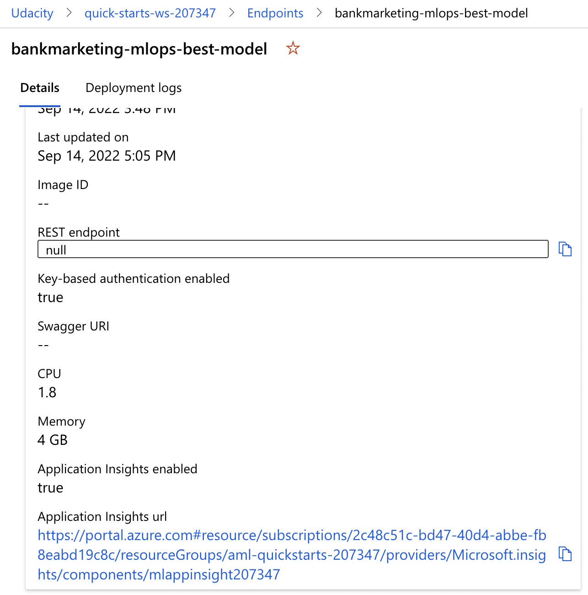

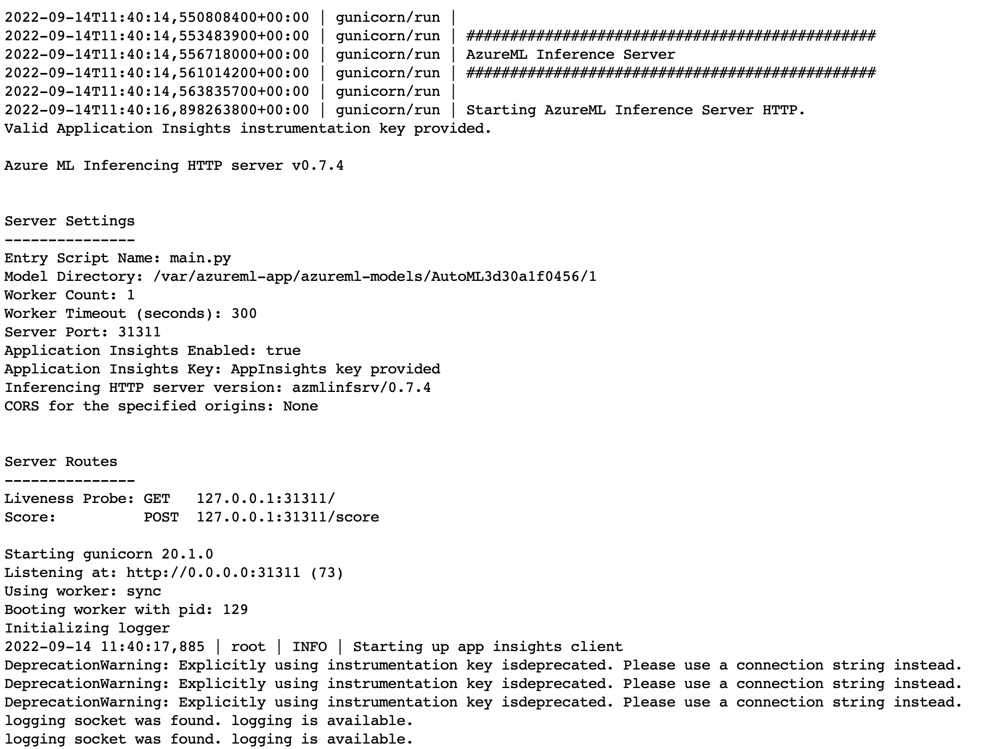

 

<b>Step 5: Swagger Documentation</b>
- Copy the swagger.json URL from the deployment, use wget to download file inside 'swagger' folder
- From /swagger directory, run "bash swagger.sh" to launch docker in localhost port 10000. You can view swagger UI in localhost:10000.
- Run "python serve.py", and insert "http://localhost:8000/swagger.json" in the search bar in Swagger UI. This will show the /score endpoint

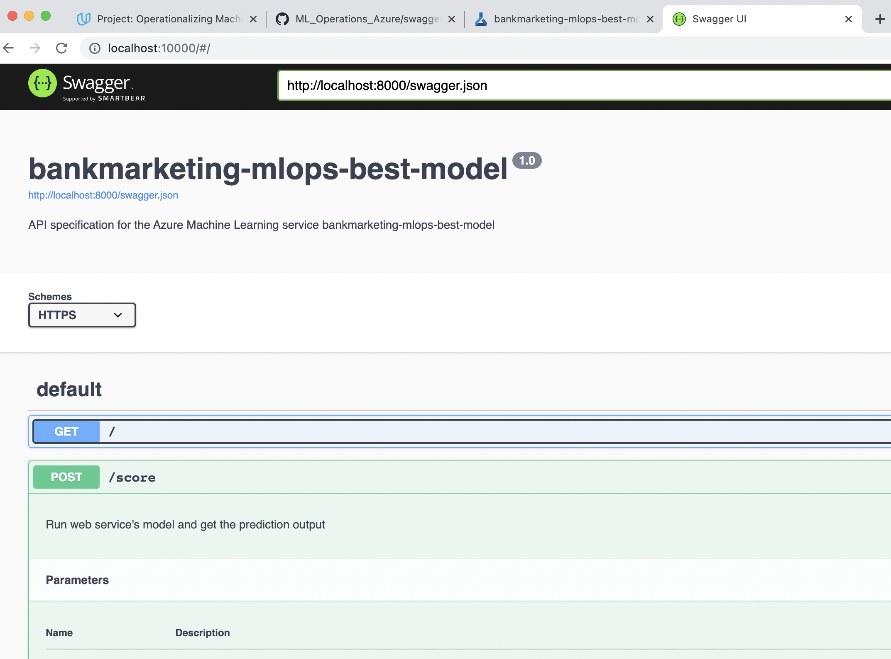

 

<b>Step 6: Consume Model Endpoint</b>
- In endpoint.py, insert the scoring_uri and key from the deployment, and run "python endpoint.py"
- Benchmark endpoint: Check if Apache Benchmark is installed. In benchmark.sh, insert appropriate key and scoring_uri and run "bash benchmark.sh"

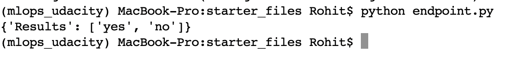

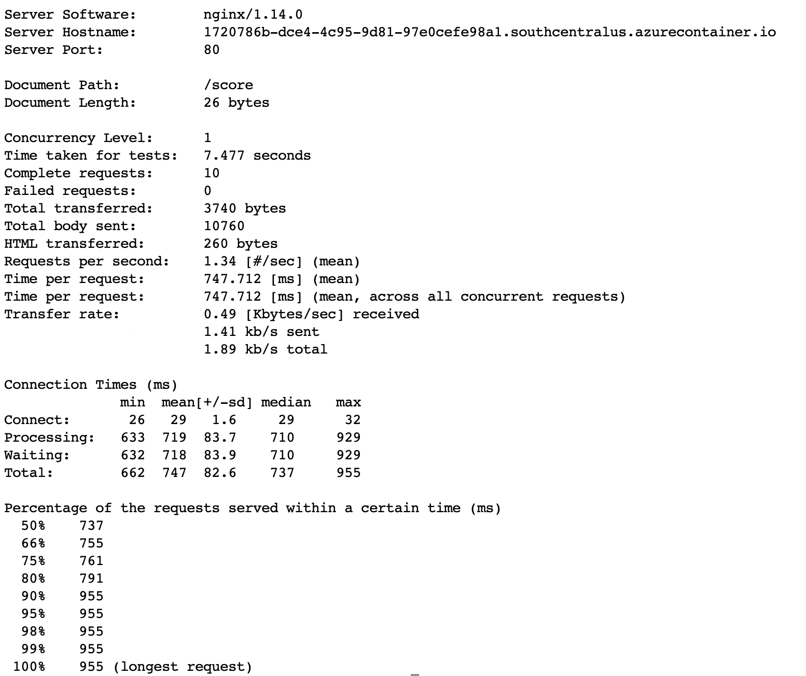

 

<b>Step 7: Create, Publish, Consume Pipeline</b>
- Run the cells in the aml-pipelines-with-automated-machine-learning-step.ipynb notebook after inserting the right cluster name, experiment name, dataset name. This would create and publish pipeline. 

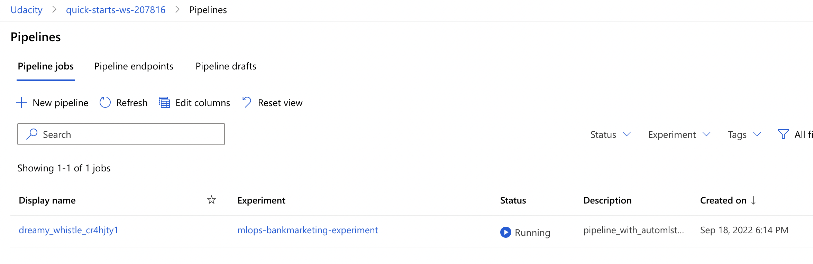

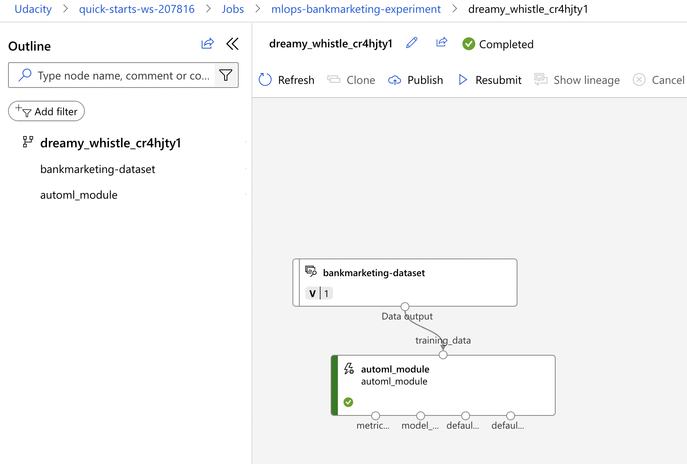

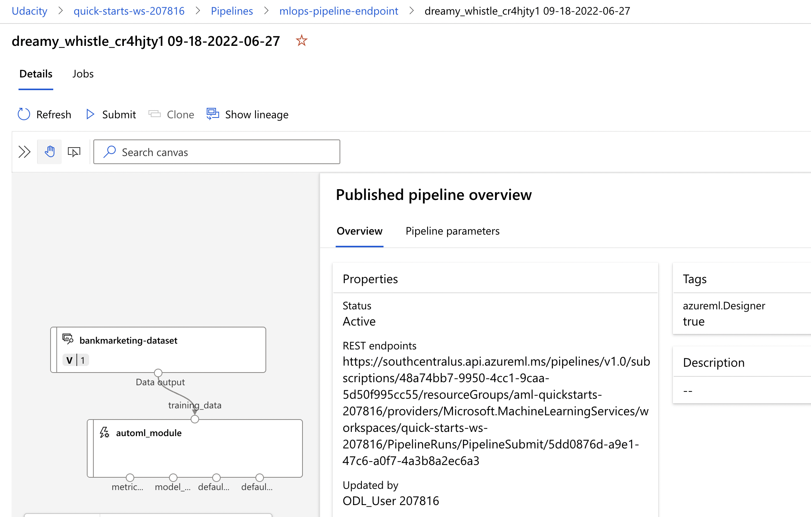

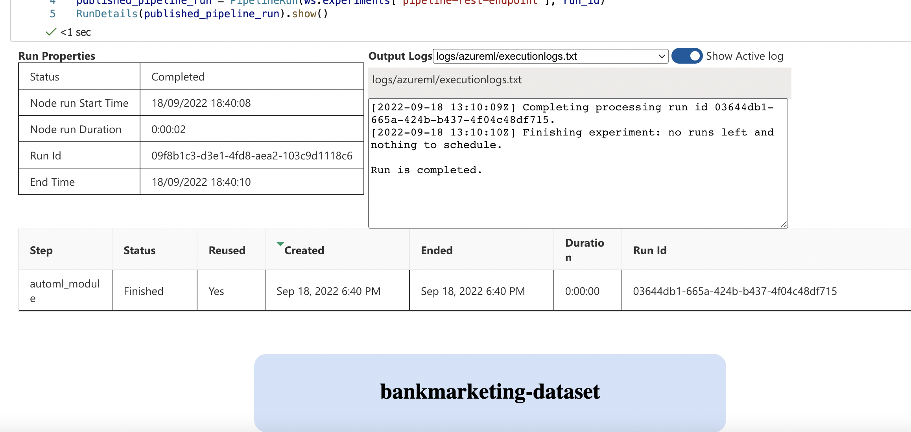

 

## How to improve the project in future
- Implement a pipeline with custom training and feature engineering components instead of AutoML
- Add into the pipeline, tests for the data and classifer model 
 

## Screen Recording
<a href="https://youtu.be/yN4VSDNOmDc">Click here for Screencast</a>
 

## Standout Suggestions
- Performed the Model Endpoint's benchmarking using Apache Benchmark (though it was optional)
- Created an environment.yml file with all the necessary packages required for the project to run. 
            => This is good practice as it makes it easier to run the project again on another device. 
            => When creating a conda environment, you can use the yaml file to install all the packages.
