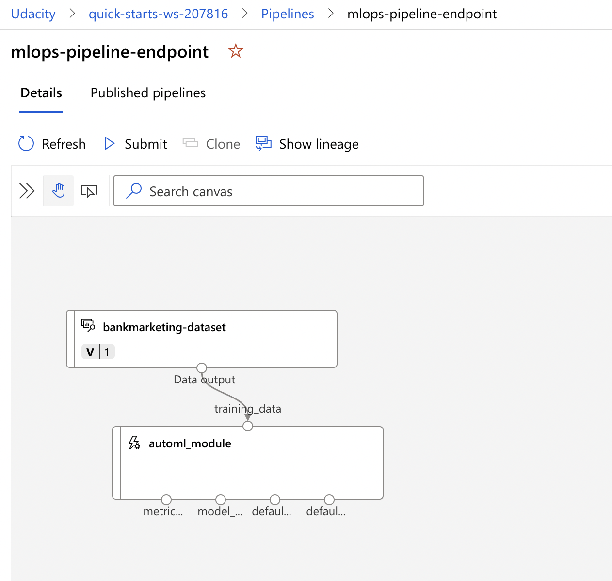

*NOTE:* This file is a template that you can use to create the README for your project. The *TODO* comments below will highlight the information you should be sure to include.

# Project Title: Operationalizing Machine Learning

Project Overview: 
- Dataset used: Bank Marketing dataset. 
- I use Azure to configure a cloud-based ML production model, deploy it, and consume it. 
- I create, publish, and consume a pipeline. 
- I demonstrate all my work by creating a README file and a screencast video.

## Architectural Diagram
*TODO*: Provide an architectual diagram of the project and give an introduction of each step. An architectural diagram is an image that helps visualize the flow of operations from start to finish. In this case, it has to be related to the completed project, with its various stages that are critical to the overall flow. For example, one stage for managing models could be "using Automated ML to determine the best model". 

## Key Steps
*TODO*: include all the screenshots
Step 1: Authentication
- I skipped this step since I used Udacity Lab and thus could not create a Service Principal

Step 2: Auto ML Experiment
- Upload data (csv file) to default datastore in Azure ML studio, and register a dataset
- Create a compute instance to be used by the jupyter notebook later 
- Create a compute cluster to be used by the AutoML experiment with min nodes as 1, and max nodes as 5
- Create an AutoML experiment with the above dataset and compute cluster

Step 3: Deploy Best Model
- Once AutoML experiment completes, deploy the best model on ACI with authentication enabled

Step 4: Enable Logging
- Create a python virtual/conda environment with libraries required to run the scripts. Activate it.
- Download config.json from Azure ML portal and store in same folder as logs.py
- In logs.py, insert the deployment name. From terminal, run "python logs.py" to enable logging

Step 5: Swagger Documentation
- Copy the swagger.json URL from the deployment, use wget to download file inside 'swagger' folder
- From /swagger directory, run "bash swagger.sh" to launch docker in localhost port 10000. You can view swagger UI in localhost:10000.
- Run "python serve.py", and insert "http://localhost:8000/swagger.json" in the search bar in Swagger UI. This will show the /score endpoint

Step 6: Consume Model Endpoint
- In endpoint.py, insert the scoring_uri and key from the deployment, and run "python endpoint.py"
- Benchmark endpoint: Check if Apache Benchmark is installed. In benchmark.sh, insert appropriate key and scoring_uri and run "bash benchmark.sh"

Step 7: Create, Publish, Consume Pipeline
- Run the cells in the aml-pipelines-with-automated-machine-learning-step.ipynb notebook after inserting the right cluster name, experiment name, dataset name. This would create and publish pipeline. 

## Screen Recording
*TODO* Provide a link to a screen recording of the project in action. Remember that the screencast should demonstrate:

## Standout Suggestions
- Performed the Model Endpoint's benchmarking using Apache Benchmark (though it was optional)
